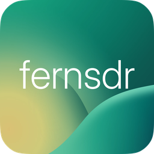
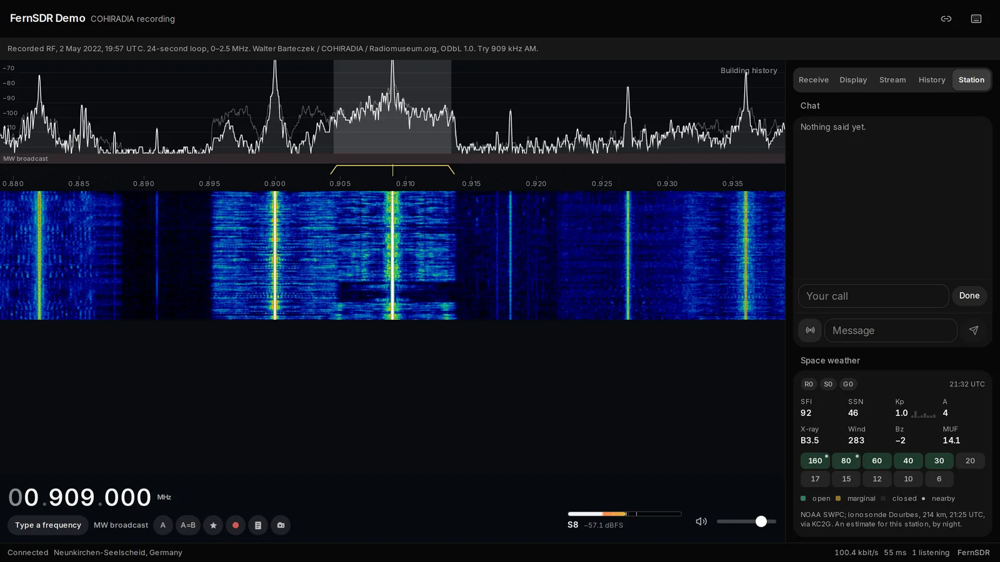
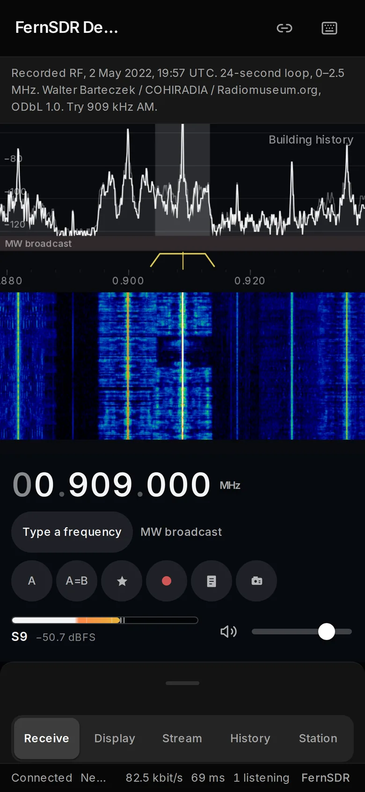
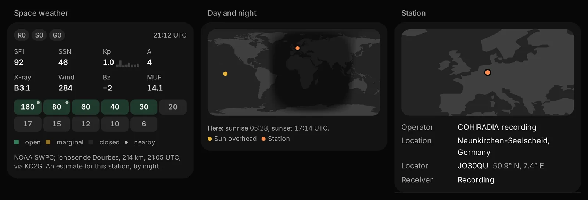
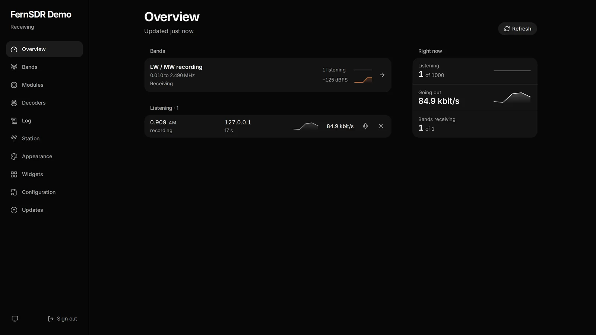

<p align="center"></p>

# FernSDR

A radio receiver you use through a web browser, and the server that runs it.

Point a radio at an antenna, run this next to it, and anyone with the link can
listen. They pick a frequency, they hear what the antenna hears, and they see a
picture of the radio spectrum scrolling past. Listeners tune independently;
the server's CPU and uplink determine how many can listen at once.

Listen to one now at [demo.fernsdr.org](https://demo.fernsdr.org), a
recording of long and medium wave, or read more at
[fernsdr.org](https://fernsdr.org).

https://github.com/user-attachments/assets/07b7c5a0-dcb1-4d97-a972-3661fd24ebb4



## Measured

Against ten other WebSDR servers (OpenWebRX, OpenWebRX+, UberSDR, NovaSDR,
PhantomSDR, PhantomSDR-Plus and its sv1btl fork, VertexSDR, ka9q-web and
PA3FWM's WebSDR), in one lab, on one generated band, with real browsers
listening and each receiver on the same two CPU cores:

| | FernSDR | Best of the others |
|---|---|---|
| Delay from the input to the browser's audio output | 227 ms | 261 ms, UberSDR |
| Listeners served on two CPU cores, at the largest step tried | 1,600 | 400, PA3FWM's WebSDR |
| Memory with four listening | 8 MB | 30 MB, PhantomSDR |
| Sound that still arrives through 24 kbit/s | 63 % | 7 %, NovaSDR (VertexSDR's arrived too changed to measure) |
| Back on time after a 15 s outage | 0.9 s | 2.0 s, PhantomSDR-Plus (sv1btl) |
| The listener's page on a first visit | 127 kB | 130 kB, VertexSDR |

The delay runs from the moment the lab's generated band leaves its source
to the moment the browser says the sound reaches its output; that estimate
was off by up to 9.3 ms in calibration, and a real radio's USB delay and the
sound card after the browser are not in it. The listener steps shared by all
receivers went up to 400, where FernSDR and PA3FWM's WebSDR both still served
everyone and the others no longer did; only FernSDR was tried at 1,600, so
neither one's limit is known.

Others do better on the stream's size, on CPU with a handful of listeners,
and on audio SNR. The method, the lab and every figure, including those, are
in [bench/](bench/); each run's own data is the archive
`fernsdr-bench-runs-20260929.tar.xz` on the [v0.1.0 release](https://github.com/Steven9101/FernSDR/releases/tag/v0.1.0).

## If none of that meant anything

Radio signals arrive at an antenna all mixed together, across a wide range of
frequencies, the way every station in a city arrives at a car aerial at once. A
receiver picks one out. This one does it in software and puts the controls on a
web page, so the radio can sit somewhere with a good antenna and quiet
surroundings while you listen from anywhere.

Three words appear throughout and are worth knowing:

- A **band** is a stretch of frequencies the radio is looking at, the way a
  camera has a field of view. 20 m is one, 40 m is another.
- The **waterfall** is the scrolling picture. Left to right is frequency, top
  to bottom is time, and brightness is how strong a signal is. Vertical lines
  are stations transmitting.
- A **passband** is how wide a slice you listen to. Narrow it to shut out the
  station next door; widen it for better audio when nobody is crowding you.

## Install it

On any Linux, on x86_64 or ARM (a Raspberry Pi 2 or later):

```sh
curl -fsSL https://github.com/Steven9101/FernSDR/releases/latest/download/install.sh | sudo sh
```

It asks where the receiver runs: at home, on a server with a domain name
(where the machine runs systemd and its distribution packages Caddy, it then
sets up HTTPS with it), or on a server without one. It installs FernSDR as a
service and prints its address and a password for the admin panel. Where
Docker runs, it offers to install the container image instead; a container
is updated by running the installer again.

Open the address, add `/admin`, and sign in. The first sign-in starts a short
setup: your own password if you want one, the station's name and place, the
radio (found on USB, its module fetched for you; an SDRplay also needs
SDRplay's own software, which the setup explains), the bands to listen to, and
whether the receiver is public. Until a radio is connected the receiver runs
a synthetic test band, so everything can be tried in a browser first.

Run the same line again to update, or to set a new admin password. Installed
as a service, the admin panel's Updates page updates too, and comes back to
the version before if the new one does not work within five minutes.

[docs/GUIDE.md](docs/GUIDE.md) goes from choosing the hardware and putting
Linux on a computer to the first listener, step by step, for people who have
never used Linux. [docs/DEPLOYMENT.md](docs/DEPLOYMENT.md) is the reference:
what goes where, Docker, HTTPS, every setting.

## Radios

| Radio | How |
|---|---|
| RTL-SDR dongles (RTL2832U: Blog V3 and V4, R820T, R828D, E4000, FC0012/13, FC2580) | the RTL-SDR module, installed by the setup |
| RX-888 MkII, 0 to 30 MHz or 0 to 60 MHz at once | the RX-888 module, installed by the setup |
| SDRplay RSP1, RSP1A, RSP1B, RSP2, RSPduo (one tuner), RSPdx | the SDRplay module, with SDRplay's own API installed first; x86_64 only |
| Airspy R2, Airspy Mini, Airspy HF+ and HF+ Discovery | the Airspy module, installed by the setup |
| anything else with a program that writes samples: HackRF, LimeSDR, Pluto, FUNcube, SoapySDR devices | a pipe into the receiver's standard input |
| ka9q-radio, or any sender of IQ over the network | UDP or multicast |

The RTL-SDR and SDRplay modules run at listeners' stations; the RX-888 module
has had its first runs on real boards, and the Airspy module has not met a
real radio yet. A radio without a module is not a
dead end: [Radios without a module](docs/DEPLOYMENT.md#radios-without-a-module)
has the commands for the common ones.

## What listeners get

- **Modes:** USB, LSB, CW, CW-L, AM, synchronous AM, NFM, DSB, and wide FM
  with RDS (station name, programme type, radiotext) on bands wide enough for
  it. A passband that can be dragged to any width, and an IF shift.
- **Sound:** automatic gain in four speeds or set by hand, noise reduction, an
  automatic notch, an automatic squelch that needs no threshold or a squelch
  level, a low cut, bass and treble, FM de-emphasis, and for NFM the CTCSS
  tone shown, removed or used as a squelch.
- **Waterfall and spectrum:** zoom and pan by mouse, touch or keyboard, four
  colour maps (one safe for colour-blind eyes), peak hold, automatic or manual
  levels, and band-plan markers for IARU Regions 1 to 3 and the US, Canada,
  UK, Germany, Australia and Japan, with FT8, WSPR, time stations and the like
  marked. Tapping a marker tunes it.
- **History:** where the operator keeps it, the waterfall of the last hours to
  scroll back through.
- **Decodes:** where the operator runs the FT8 decoder, what it heard, on a
  list and a world map, one click away from being tuned.
- **Tools:** VFO A and B, bookmarks, recording to a file, a logbook with ADIF
  export, and control of a radio of your own over its serial port (Kenwood,
  Elecraft, Flex, Yaesu, Icom), so the receiver can follow your rig or the
  other way round. Programs made for PA3FWM's WebSDR, such as CATSync, work
  with it.
- **A chat** where frequencies are links, and a button that puts where you
  are listening into the message.
- **Links that open on the same signal**, with its mode, filter and zoom.
- **Keyboard shortcuts** for tuning, volume, zoom, filter and mode; `?` lists
  them.
- **Two levels of controls:** *Essential* shows what most people need, *Full*
  the rest. Frequency, filter and zoom are remembered for each band.
- **The page arranged to taste:** hide what you do not use, pick the meter's
  face and set how tall the spectrum is, right on the page (`L`).
- **Phones:** the same page, with the controls in a sheet that slides up.
- **Stream quality** to choose, and a connection that gives up waterfall
  detail before it gives up sound when the network is slow.

<p align="center">
  
  &nbsp;
  
</p>

## What operators get

- **An admin panel** at `/admin`, as usable on a phone as on a desktop:
  - each band live, why one is not receiving and a button to restart it, and
    for a hardware radio its gain, clipping and dropped samples;
  - who is listening, with a chat mute that outlasts a restart;
  - band settings: name, audio quality, widest filter, noise blanker, DC and
    IQ correction, frequency correction measured against a known station, an
    S-meter calibrated in dBm, and the waterfall archive;
  - **hours on the air** for each band, as times of day or by sunrise and
    sunset at the station, so one radio can serve 40 m at night and 20 m by
    day, listeners following from one to the other;
  - hardware modules and decoders installed and updated from a catalog, FT8
    spots reported to PSK Reporter at the switch of a button;
  - the station's details, a listing on sdr-list.xyz, and the password;
  - the page's colours, background picture and widgets: clock, space
    weather and band conditions, greyline map, lightning map, links, notices,
    pictures and embedded pages;
  - the log, and the configuration file itself, checked before it is saved;
  - updates with automatic rollback, and a backup file to move the receiver
    to another computer.
- **Installs and updates** without dependencies on any Linux: systemd, OpenRC,
  runit or SysV init; Debian, Ubuntu, Fedora, Alpine, Arch and the rest; or a
  Docker container. The released programs are static.
- **Monitoring:** `/api/status`, `/api/health` and Prometheus `/metrics`.



## Asking for something

If FernSDR does not support your radio, a decoder you want, or does something
in a way that gets in your way, [open an issue](https://github.com/Steven9101/FernSDR/issues/new/choose).
You do not need to be a programmer or know how it works inside: say what you
have and what you would like, in your own words. That is how the next module
gets chosen. Security problems go to the
[private report form](https://github.com/Steven9101/FernSDR/security/advisories/new)
instead.

## Build it yourself

Use Linux with a C++17 compiler and Make. Building the browser files also
needs Node.js 20.19+ or 22.12+ and npm. On Debian or Ubuntu, install the server
build tools with `sudo apt-get install build-essential`.

```sh
tools/source-install.sh
```

The script builds and tests the server, builds the page, writes
`server/fernsdr.conf` with a new admin password if it does not exist, prints
the password, and starts a synthetic radio. Open <http://localhost:8073> and
press **Start audio**. Stop it with Ctrl-C.

For another port, use `tools/source-install.sh --port 8090`; to install it as
a systemd service, `sudo tools/source-install.sh --service`. Existing settings are kept when you rerun it. Set
`FERNSDR_JOBS=1` before the command to build with one compiler job when
memory is tight.

Node is a build tool, not a server requirement. The server links only the
system C/C++ runtime, math and threading libraries. FFTs use SSE2 on x86 and
NEON on ARM; the same x86 program selects AVX2, and on AMD AVX-512, when the
machine has them.

## How it is built

One server program and a browser client built on two libraries, Svelte and
the Lucide icons, with the Inter typeface. The audio codec, waterfall codec,
DSP and HTTP server live in this repository. Each band shares its large FFT
across listeners. Each listener has independent
tuning, audio processing and a bandwidth budget. Hardware and decoders are
separate programs, modules, that the server starts and talks to through
pipes, so a driver that crashes or hangs takes its module down, not the
receiver.

[docs/PRINCIPLES.md](docs/PRINCIPLES.md) says how everything here is built,
[docs/ARCHITECTURE.md](docs/ARCHITECTURE.md) explains the shape of it,
[docs/MODULES.md](docs/MODULES.md) how modules work and how to write one,
[docs/CODEC.md](docs/CODEC.md) the audio and waterfall codecs,
[docs/PERFORMANCE.md](docs/PERFORMANCE.md) the measurements and how they were taken,
[docs/PROTOCOL.md](docs/PROTOCOL.md) the wire format,
[docs/DESIGN.md](docs/DESIGN.md) the interface,
and [docs/TESTING.md](docs/TESTING.md) how everything is checked.

## Tests

```sh
make -C server test    # the DSP, the codecs, the server, the admin login
cd web && npm test     # the client
```

## Licence

GNU Affero General Public License, version 3: see [LICENSE](LICENSE).
